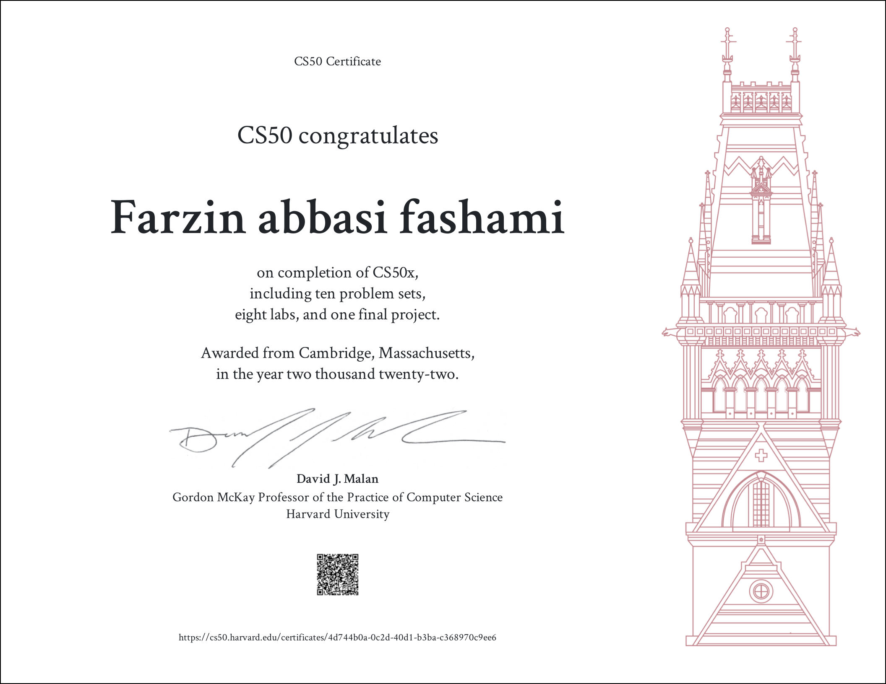
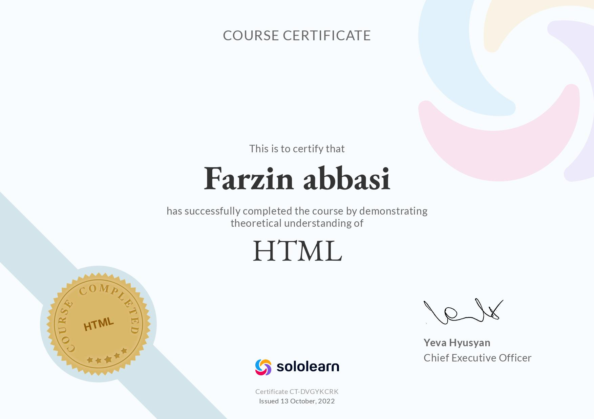

### Hi, I’m farzin 

💻 &nbsp;I'm back-end developer.\
💡 &nbsp;I want to learen every day.\

 

 

### 🛠 &nbsp;Tech Stack
&nbsp;
&nbsp;
&nbsp;

&nbsp;
&nbsp;
&nbsp;
&nbsp;
&nbsp;
&nbsp;
&nbsp;
&nbsp;

### certificates
&nbsp; &nbsp;&nbsp;&nbsp; 

### Github Status
&nbsp; ;

### contact with me

